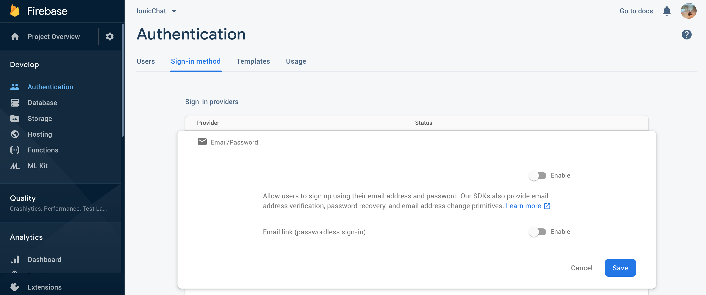

# Chat APP with firebase

## Init firebase
### Install deps
`npm install @angular/fire firebase --save`

### Creating the firebase app
1. Go to console (https://console.firebase.google.com/?pli=1)[https://console.firebase.google.com/?pli=1]
2. Create your project
3. Click on "Add Firebase to your web app"

Then, we will add it to our app for the wanted environment
in `src/environments`, put the credentials:
`
export const environment = {
 production: false,
 firebase: {
   apiKey: "YOUR_API_KEY",
   authDomain: "YOUR_AUTH_DOMAIN",
   databaseURL: "YOUR_DATABASE_URL",
   projectId: "YOUR_PROJECT_ID",
   storageBucket: "YOUR_STORAGE_BUCKET",
   messagingSenderId: "YOUR_SENDER_ID"
 }
};
`
4. Init Firefase authentication method

5. Generate an angular service 
`ionic generate service auth`
6. Add functions to register and login
7. Call this functions from two pages that you generated
8. Run and test. If everythings works fine, your user appears in Firebase Authentication dashboard and login succeed